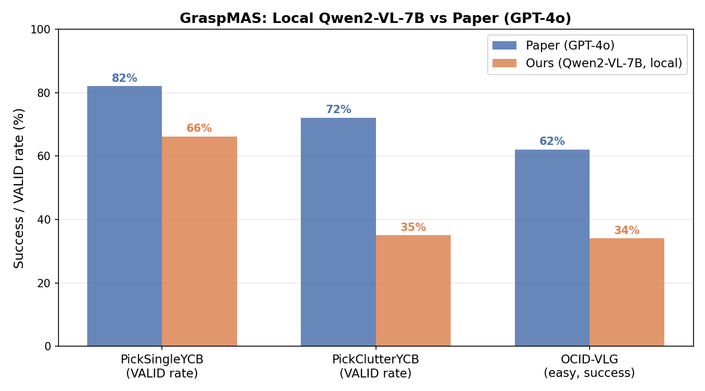

<div align="center"><h1> GraspMAS: Zero-Shot Language-driven Grasp Detection with Multi-Agent System<br>
</h1>
<p align="center">
    <a href="https://scholar.google.com/citations?user=F5Fr2ysAAAAJ&hl=vi" style="text-decoration: none;">Quang Nguyen</a> •
    <a href="https://scholar.google.com/citations?user=t6RXOWgAAAAJ&hl=vi" style="text-decoration: none;">Tri Le</a> •
    <a href="https://scholar.google.com/citations?user=T_LryjgAAAAJ&hl=en" style="text-decoration: none;">Huy Nguyen</a> •
    <a href="https://sites.google.com/tdtu.edu.vn/vongocthieu" style="text-decoration: none;">Thieu Vo</a> •
    <a href="https://scholar.google.it/citations?user=KUqlbGUAAAAJ&hl=en" style="text-decoration: none;">Tung Ta</a> •
    <a href="https://scholar.google.com/citations?user=unbPvWAAAAAJ&hl=zh-CN" style="text-decoration: none;">Baoru Huang</a> •
    <a href="https://scholar.google.com/citations?hl=th&user=qyExc4QAAAAJ&view_op=list_works" style="text-decoration: none;">Minh Vu</a> •
    <a href="https://www.csc.liv.ac.uk/~anguyen/" style="text-decoration: none;">Anh Nguyen</a>
</p>
<h1><sub><sup><a href="https://www.iros25.org/">IROS 2025</a></sup></sub></h1>

[](https://zquang2202.github.io/GraspMAS/) 
[](https://arxiv.org/abs/2506.18448)

</div>

# Introduction


In this paper, we introduce GraspMAS, a new multi-agent system framework for language-driven grasp detection. GraspMAS is designed to reason through ambiguities and improve decision-making in real-world scenarios.


Our method consistently produces more plausible grasp poses than existing methods.

---

> **This fork** replaces the OpenAI API with a fully local **Qwen2-VL-7B-Instruct** backend running on **AMD MI300X (ROCm 6.2.4)** — no cloud API cost, no internet dependency. It also adds a physics-aware gripper force estimation pipeline and zero-shot YCB mass prediction.  
> See [Local Setup](#local-setup-amd-rocm) to get started.

---

# Installation

### Original (NVIDIA CUDA)

```bash
git clone --recurse-submodules https://github.com/Fsoft-AIC/GraspMAS.git
cd GraspMAS
echo YOUR_OPENAI_API_KEY_HERE > api.key

conda create -n graspmas python=3.9 -y
conda activate graspmas
conda install -c "nvidia/label/cuda-11.8.0" cuda-toolkit
conda install pytorch==2.2.0 torchvision==0.17.0 torchaudio==2.2.0 pytorch-cuda=11.8 -c pytorch -c nvidia
pip install -r requirements.txt
cd detectron2 && pip install -e . && cd ..
bash download.sh
```

### Local Setup (AMD ROCm)

Requires AMD GPU with ROCm 6.2+. Model: `Qwen2-VL-7B-Instruct` at `/mnt/data/mritunjoyh/models/Qwen2-VL-7B-Instruct`.

```bash
conda create -n graspmas python=3.9 -y
conda activate graspmas

# PyTorch ROCm build
pip install torch==2.5.1+rocm6.2 torchvision torchaudio --index-url https://download.pytorch.org/whl/rocm6.2

# Core deps — order matters (numpy pin is critical)
pip install "numpy==1.26.4" "mplib==0.1.1"
pip install toppra --no-binary toppra          # must build from source against numpy 1.26.x
pip install "transformers==4.48.0"             # 4.49+ blocks torch.load on torch<2.6
conda install -c conda-forge scipy -y          # conda-forge build avoids ROCm conflicts
pip install -r requirements.txt

cd detectron2 && pip install -e . && cd ..
bash download.sh
```

**Critical version pins:**

| Package | Version | Reason |
|---|---|---|
| `numpy` | 1.26.4 | mplib and toppra Cython extensions compiled against numpy 1.x |
| `mplib` | 0.1.1 | mani-skill 3.0.1 requires exactly this version |
| `transformers` | 4.48.0 | 4.49+ raises CVE-2025-32434 error with torch 2.5 |
| `toppra` | source build | pip wheel compiled against wrong numpy; must rebuild |

**GPU routing** (adjust to your free GPU index):
```bash
CUDA_VISIBLE_DEVICES=2 VLM_DEVICE=cuda:0 python run_maniskill_demo.py
```

---

# Quickstart

```bash
# Single image inference
python main_simple.py --query "Grasp the knife at its handle" \
    --image-path path/to/image.png --api-file api.key

# ManiSkill robot demo (reproducible seed)
CUDA_VISIBLE_DEVICES=2 VLM_DEVICE=cuda:0 python -u run_maniskill_demo.py --seed 17

# YCB single-object benchmark (74 objects)
CUDA_VISIBLE_DEVICES=2 VLM_DEVICE=cuda:0 python -u run_graspmas_eval.py

# YCB cluttered benchmark (100 seeds)
CUDA_VISIBLE_DEVICES=2 VLM_DEVICE=cuda:0 python -u run_graspmas_cluttered_eval.py

# Mass prediction eval (78 objects, 5-fold CV)
CUDA_VISIBLE_DEVICES=2 VLM_DEVICE=cuda:0 python -u eval_mass.py
```

---

# Configuration

To customize tools or model hyperparameters refer to **`image_patch.py`**. The GraspMAS framework relies heavily on the effectiveness of its pretrained perception tools — feel free to swap in newer models. Note that models like BLIP2 and VLpart require significant GPU memory.

---

# ManiSkill Demo

<p align="center">
    
</p>

The script `run_maniskill_demo.py` runs the full GraspMAS pipeline end-to-end in ManiSkill: object detection → grasp prediction → motion planning → robot execution.

```bash
CUDA_VISIBLE_DEVICES=2 VLM_DEVICE=cuda:0 python -u run_maniskill_demo.py --seed 17
```

## Pipeline

```
Seed → PickClutterYCB-v1 (SAPIEN/PhysX, CPU sim)
            │
            ▼  1. Observation
   RGB + depth + third-person view  →  runs/<ts>/imgs/observation.png
            │
            ▼  2. Ground-truth physics  (grasp_force.py)
   mass + friction from SAPIEN  →  F_required = safety × m × g / (2μ)
            │
            ▼  3. GraspMAS multi-agent loop  (Qwen2-VL-7B)
   ┌──────────────────────────────────────────────────────┐
   │  PLANNER  →  step-by-step natural language plan      │
   │  CODER    →  executable Python via ImagePatch API    │
   │    find()            ←  GroundingDINO + SAM          │
   │    grasp_detection() ←  GraspNet (RAGT)              │
   │    find_part()       ←  VLpart                       │
   │  OBSERVER →  reviews RGB + grasp overlay             │
   │    VALID: return  |  INVALID: retry (max 5 rounds)   │
   └──────────────────────────────────────────────────────┘
            │  2D grasp: (quality, cx, cy, w, h, angle)
            ▼  4. 2D → 6DoF projection
   depth[cy,cx] → 3D camera space  (intrinsics K)
   camera extrinsics  →  world coordinates
   jaw angle  →  gripper orientation
            │
            ▼  5. Motion planning + execution  (mplib + toppra)
   PandaArmMotionPlanningSolver:
     (a) Reach  — approach 5 cm above grasp pose
     (b) Grasp  — move in, close gripper
     (c) Lift   — move to goal 40 cm above table
            │
            ▼  6. Contact force validation
   get_contact_forces()  →  compare actual vs F_required
            │
            ▼  Outputs
   runs/<ts>/imgs/    — observations + grasp overlays
   runs/<ts>/video/   — full episode video
```

**Failure modes:** no detection → exit early; bad depth → warning + attempt; planner path failure → SAPIEN error, no lift.

---

# Directional 6-DoF Grasping

This fork extends the base GraspMAS pipeline with **language-conditioned approach directions**: the direction word in the prompt ("top", "right", "left", "bottom") determines the 3D trajectory the robot uses to approach and grasp the object, not just the 2D contact point.

## Pipeline

```
Prompt: "Pick the orange up from the right hand side"
                │
                ▼ GraspMAS (Planner→Coder→Observer)
        grasp_detection_directional(patch, "right")
                │  selects RAGT candidate closest to right edge of mask
                ▼
        2D grasp: (q, cx, cy, w, h, θ)   ← θ = jaw rotation only
                │
                ▼ 2D → 6-DoF
        grasp_center = obj_pos + dir_offset   ← GT position + bbox offset
        approach_dir = [0, -1, -1]/√2         ← camera-right = world +Y
        closing_dir  = Gram-Schmidt(θ, approach_dir)
        grasp_6d     = build_grasp_pose(approach_dir, closing_dir, grasp_center)
                │
                ▼ Motion planning
        pre-grasp → grasp → close gripper → lift
```

The key coordinate-frame insight: the camera looks in the **−X direction** from position `(0.3, 0, 0.6)`, so camera-right maps to world **+Y** (not +X). The robot base is at X = −0.615, making ±X approaches kinematically asymmetric. Full derivation in [docs/DIRECTIONAL_6DOF.md](docs/DIRECTIONAL_6DOF.md).

## Batch Results — 49 YCB objects × 4 directions

| Direction | Approach | Success |
|-----------|----------|---------|
| top | `[0, 0, −1]` | 24/39 **(62%)** |
| right | `[0, −1, −1]/√2` | 13/39 **(33%)** |
| left | `[0, +1, −1]/√2` | 6/39 **(15%)** |
| bottom | `[0, 0, −1]` | 24/40 **(60%)** |
| **Total** | | **67/157 (42.7%)** |

**6 perfect objects (4/4):** apple, lemon, orange, softball, tennis ball, cups.

Run the full batch:

```bash
CUDA_VISIBLE_DEVICES=3 VLM_DEVICE=cuda:0 PYOPENGL_PLATFORM=egl \
    nohup python run_all_objects_demo.py --seed 42 > logs/batch.log 2>&1 &
```

Single object (any `--object-id`):

```bash
CUDA_VISIBLE_DEVICES=3 VLM_DEVICE=cuda:0 PYOPENGL_PLATFORM=egl \
    python run_mustard_demo.py --object-id 013_apple --seed 42
```

Semantic part grasping (loop / right handle / left handle):

```bash
CUDA_VISIBLE_DEVICES=3 VLM_DEVICE=cuda:0 PYOPENGL_PLATFORM=egl \
    python run_clamp_parts_demo.py
```

---

# Results

## ManiSkill Benchmarks

Our primary results on ManiSkill — comparing local Qwen2-VL-7B against the paper's GPT-4o numbers.

<p align="center">
    
</p>

| Benchmark | Setting | Ours (Qwen2-VL-7B) | Paper (GPT-4o) | Gap |
|---|---|---|---|---|
| **PickSingleYCB** | VALID rate, 74 objects | **66.2%** (49/74) | 82.0% | −15.8 pp |
| **PickClutterYCB** | VALID rate, 100 seeds | **35.0%** (35/100) | 72.0% | −37.0 pp |
| **OCID-VLG** | Success, 100 samples (all categories) | **13.0%** (13/100) | 62.0% | −49.0 pp |
| **OCID-VLG** | Success, 100 samples (easy subset) | **34.0%** (34/100) | 62.0% | −28.0 pp |
| **YCB Mass** | MAE, 78 objects (5-fold CV) | **0.180 kg** | — | — |

> The gap on simple, visually distinctive queries narrows significantly: apple and ball categories match the paper's overall baseline (62%) on the easy OCID-VLG subset.  
> Speed: ~13× slower than GPT-4o API (local 7B inference without quantization). 4-bit quantization would reduce latency to ~5–8s/sample.

**Detailed analysis:**
- [docs/GRASPMAS_QWEN.md](docs/GRASPMAS_QWEN.md) — single + cluttered YCB results, per-category breakdown
- [docs/QWEN_OCIDVLG.md](docs/QWEN_OCIDVLG.md) — OCID-VLG deep dive, failure modes, prompt fixes applied

---

## Mass Prediction

Zero-shot YCB mass estimation using chain-of-thought decomposition with embedding-based anchor retrieval.

| Metric | Value |
|---|---|
| Detection rate | 100% (78/78) |
| MAE | 0.1803 kg |
| MAPE | 126.4% |
| Median error | 70.0% |
| < 25% error | 20.5% (16/78) |
| < 50% error | 32.1% (25/78) |

See [docs/MASS_EVAL.md](docs/MASS_EVAL.md) for full analysis, ablation results, and failure mode breakdown.

---

## Force Estimation

Physics-aware gripper force estimation: ground-truth simulator physics vs Qwen2-VL visual estimates across all 78 YCB objects.

- **E0 baseline** (`run_force_benchmark.py`) — raw VLM force estimation
- **E1 experiment** (`run_benchmark_e1.py`) — material classification + lookup table friction (3 variants)

See [docs/FORCE_ESTIMATION.md](docs/FORCE_ESTIMATION.md) for methodology and results.

---

# Documentation

| File | Contents |
|---|---|
| [SCRIPTS.md](SCRIPTS.md) | Every script: purpose, CLI flags, expected outputs, conda env pins |
| [docs/DIRECTIONAL_6DOF.md](docs/DIRECTIONAL_6DOF.md) | Directional 6-DoF grasping: pipeline, coordinate frame, results, limitations |
| [docs/GRASPMAS_QWEN.md](docs/GRASPMAS_QWEN.md) | System architecture, PickSingleYCB + PickClutterYCB results |
| [docs/GRASP_EXAMPLES.md](docs/GRASP_EXAMPLES.md) | Grasp pose format `(q, cx, cy, w, h, θ)`, worked examples |
| [docs/MASS_EVAL.md](docs/MASS_EVAL.md) | YCB mass prediction: pipeline, v1→v2 improvements, ablations |
| [docs/QWEN_OCIDVLG.md](docs/QWEN_OCIDVLG.md) | OCID-VLG evaluation: 13% full / 34% easy, per-category breakdown |
| [docs/FORCE_ESTIMATION.md](docs/FORCE_ESTIMATION.md) | Gripper force estimation: E0 baseline + E1 material table |

---

# Note

This is a research project and may not be optimized, regularly updated, or actively maintained.

---

# Citation

```bibtex
@inproceedings{nguyen2025graspmas,
    title  = {GraspMAS: Zero-Shot Language-driven Grasp Detection with Multi-Agent System},
    author = {Nguyen, Quang and Le, Tri and Nguyen, Huy and Vo, Thieu and Ta, Tung D
              and Huang, Baoru and Vu, Minh N and Nguyen, Anh},
    booktitle = {IROS},
    year      = {2025}
}
```

# Acknowledgement

We thank the valuable work of [ViperGPT](https://github.com/cvlab-columbia/viper) and [ViperDuality](https://github.com/duality-robotics/viper/tree/main) that inspired and enabled this research.
