# Directional 6-DoF Grasping Extension

Language-conditioned approach direction for YCB object grasping in ManiSkill.  
Built on top of the GraspMAS multi-agent pipeline (IROS 2025).

---

## Motivation

The base GraspMAS paper outputs a **2D grasp rectangle** `(quality, cx, cy, w, h, θ)` and always approaches with a fixed top-down vector `[0, 0, −1]`. Every prompt — "pick from the top", "pick from the right", "pick from the bottom" — produces the same gripper trajectory. Only the jaw angle `θ` changes.

This extension maps the **direction word in the natural language prompt** to a distinct 3D approach vector and contact offset, giving the robot genuinely different trajectories and contact points for each directional prompt.

<p align="center">
  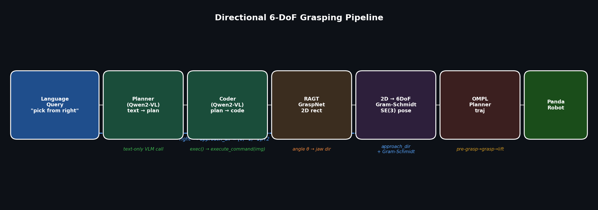
</p>

---

## What Changed from the Base Paper

| Component | Base GraspMAS | This fork |
|-----------|--------------|-----------|
| VLM backend | GPT-4o (OpenAI API) | Qwen2-VL-7B-Instruct (local, AMD ROCm) |
| Coder output | `list` grasp rectangle | `{"grasp": [...], "approach": "top"}` dict |
| Grasp selection | highest RAGT quality score | direction-biased candidate selection |
| 3D approach vector | always `[0, 0, −1]` | direction lookup table (4 vectors) |
| Grasp center | depth unprojection | GT simulator position + bbox offset |
| `closing_dir` | `[cos(θ), sin(θ), 0]` | Gram-Schmidt: `closing_dir ⊥ approach_dir` |

---

## Pipeline Changes

### 1. VLM Coder — Direction-Aware Output (Option B)

The Coder agent is prompted to return a dict instead of a plain list when a direction word is present:

```python
# Coder-generated code for: "Pick the mustard bottle from the right"
def execute_command(image):
    patch = ImagePatch(image)
    obj = patch.find("mustard bottle")[0]
    grasp = patch.grasp_detection_directional(obj, "right")
    return {"grasp": grasp, "approach": "right"}
```

The coder prompt rule (`agents/prompt/coder_prompt.py`):
> *"Use `grasp_detection_directional(patch, direction)` when the query mentions a specific side (top/bottom/left/right). Use `grasp_detection(patch)` otherwise."*

`graspmas.py` unpacks the dict and stores `self.last_approach = "right"`, which is then read by the demo scripts to set the 3D approach vector.

### 2. Directional Candidate Selection in RAGT (`detect_grasp_directional`)

**File:** `grasp/unit_grasp_pose_generation.py` — `detect_grasp_directional(grasp_model, image, mask, device, direction)`

Standard `detect_grasp()` picks the single highest-quality candidate from RAGT GraspNet. The directional version:

1. Lowers the confidence threshold progressively (`0.5 → 0.2 → 0.05`) to collect ≥ 3 candidates.
2. Computes a **target point** 30% in from the requested edge of the object mask bounding box:
   ```
   top    → (cx_mid,  y_min + 0.3 × (cy_mid − y_min))
   bottom → (cx_mid,  y_max − 0.3 × (y_max − cy_mid))
   left   → (x_min + 0.3 × (cx_mid − x_min),  cy_mid)
   right  → (x_max − 0.3 × (x_max − cx_mid),  cy_mid)
   ```
3. Picks the candidate whose center `(cx, cy)` is closest to that target point.

The jaw angle `θ` from the selected candidate is used for the 3D closing direction.

### 3. ImagePatch API Extension

**File:** `image_patch.py` — `ImagePatch.grasp_detection_directional(object_patch, direction)`

Wraps `detect_grasp_directional` with the same resize / coordinate-rescale logic as the existing `grasp_detection()`. The method is exposed to the VLM Coder via a docstring with usage examples.

### 4. 2D → 6-DoF Pose Construction

**File:** `run_all_objects_demo.py` (and `run_mustard_demo.py`)

The 2D grasp rectangle `(q, cx, cy, w, h, θ)` is projected to a full 6-DoF `sapien.Pose`:

```
cx, cy  ← discarded (patch-relative; PickSingleYCB crop geometry makes them unreliable for 3D)
θ       ← jaw closing direction in world XY plane
```

**Step A — 3D grasp center (GT position + directional offset):**

```python
obj_pos  = env.unwrapped._objs[0].pose.p[0]          # GT simulator position
bounds   = collision_mesh.bounding_box.bounds          # AABB in local frame
hy       = (bounds[1,1] − bounds[0,1]) / 2 × 0.55    # 55% of half Y-extent
hz       = (bounds[1,2] − bounds[0,2]) / 2 × 0.55    # 55% of half Z-extent

dir_offset = {
    "top"   : [0,   0,  hz ],       # upper face contact
    "bottom": [0,   0, −hz×0.5],    # lower face (table blocks full −hz)
    "right" : [0,  hy,  0  ],       # +Y face contact
    "left"  : [0, −hy,  0  ],       # −Y face contact
}
grasp_center = obj_pos + dir_offset[direction]
```

**Step B — Approach direction:**

<p align="center">
  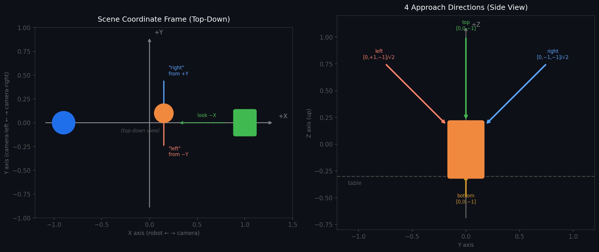
</p>

```python
approach_dir = {
    "top"   : np.array([0.0,  0.0, −1.0]),
    "bottom": np.array([0.0,  0.0, −1.0]),
    "right" : np.array([0.0, −1.0, −1.0]) / √2,   # from +Y side at 45°
    "left"  : np.array([0.0, +1.0, −1.0]) / √2,   # from −Y side at 45°
}
```

**Step C — Gram-Schmidt orthogonalisation:**

`build_grasp_pose` requires `approach_dir ⊥ closing_dir`. After changing `approach_dir` from `[0,0,−1]` to an angled vector, the XY-plane closing direction from RAGT is no longer orthogonal:

```python
closing_dir = np.array([cos(θ), sin(θ), 0.0])
closing_dir = closing_dir − np.dot(closing_dir, approach_dir) × approach_dir
closing_dir = closing_dir / ‖closing_dir‖
```

**Step D — Build pose and execute motion:**

```python
grasp_6d = env.unwrapped.agent.build_grasp_pose(approach_dir, closing_dir, grasp_center)

planner.move_to_pose_with_screw(grasp_6d * Pose([0, 0, −0.05]))        # pre-grasp (5 cm back)
planner.move_to_pose_with_screw(grasp_6d * Pose([0.005, 0, 0.015]))    # close in
planner.close_gripper()
planner.move_to_pose_with_screw(grasp_6d * Pose([0, 0, −0.4]))         # lift 40 cm
```

---

## Coordinate Frame Reference

```
Top-down view of ManiSkill PickSingleYCB:

         +Y  (camera-right → world +Y, "pick from right" direction)
          │
          │
 Robot ───┼──────── Object ─────── Camera
X=−0.615  │       X≈0.07,Y≈0.08    X=+0.3, Z=+0.6
          │
         −Y  (camera-left → world −Y, "pick from left" direction)

         −X ────────────────────── +X
       (robot side)             (camera side)

+Z = up
```

Camera eye: `(0.3, 0, 0.6)`, target: `(−0.1, 0, 0.1)`.  
Forward ≈ `(−0.625, 0, −0.781)`. Right axis = `+Y` (Z-up cross product).

**Why ±Y, not ±X for left/right?**  
The robot base is at X = −0.615. A `+X` approach (from the camera side) requires the gripper to reach past the object away from the robot — outside comfortable workspace. A `−X` approach (from the robot side) enters from behind the robot. Both ±X are kinematically awkward. The ±Y axis is symmetric and reachable for both directions.

---

## Demo: Mustard Bottle (024_mustard_bottle)

<p align="center">
  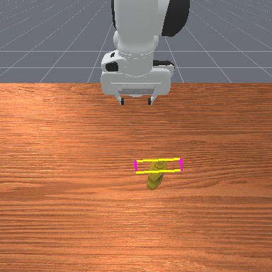
  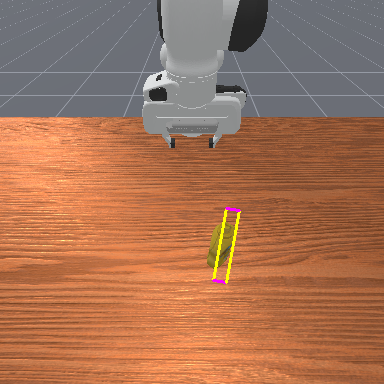
  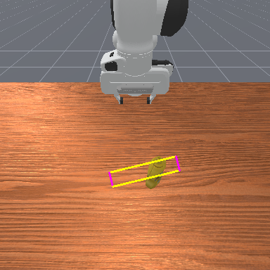
  
  <br>
  <em>RAGT grasp rectangle (green box) selected for each direction</em>
</p>

<p align="center">
  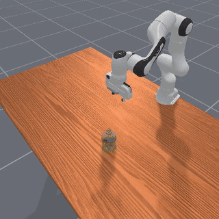
  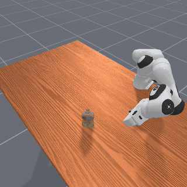
  
  
  <br>
  <em>Robot execution for "top" / "right" / "left" / "bottom" prompts (seed=42)</em>
</p>

## Demo: Orange — Perfect Object (017_orange, 4/4)

Round, symmetric objects succeed from all directions. The orange is one of 4 perfect objects in the batch.

<p align="center">
  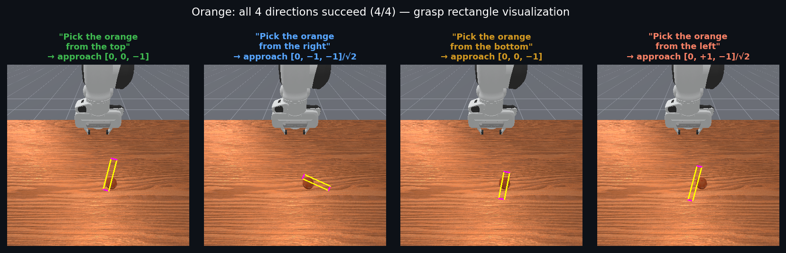
</p>

<p align="center">
  
  
  
</p>

## Demo: Semantic Part Grasping (050_medium_clamp)

For objects with named parts, `find_part(object, part)` (backed by VLPart) localises a sub-region mask. The same 6-DoF pipeline applies:

```python
# run_clamp_parts_demo.py
prompts = [
    ("loop",         "Pick the medium clamp up by grasping the loop"),
    ("right_handle", "Pick the medium clamp up by grasping the right handle"),
    ("left_handle",  "Pick the medium clamp up by grasping the left handle"),
]
approach_dir = {
    "loop"        : [0,  0, −1],            # top-down for the spring loop
    "right_handle": [0, −1, −1] / √2,       # from +Y (camera-right)
    "left_handle" : [0, +1, −1] / √2,       # from −Y (camera-left)
}
```

<p align="center">
  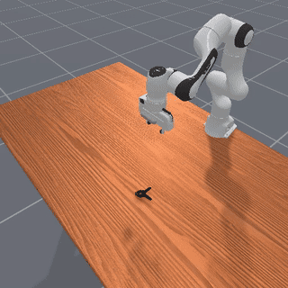
  
  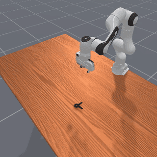
  <br>
  <em>"grasp the loop" / "grasp the right handle" / "grasp the left handle"</em>
</p>

---

## Results

### Full Batch: 49 YCB Objects × 4 Directions (165 attempts, seed=42)

> Note: multi-variant objects (4 cups, 2 toy_airplane, 7 lego_duplo) share folder names;
> resume-skip logic de-duplicates them. Effective unique objects per direction: 39–42.

<p align="center">
  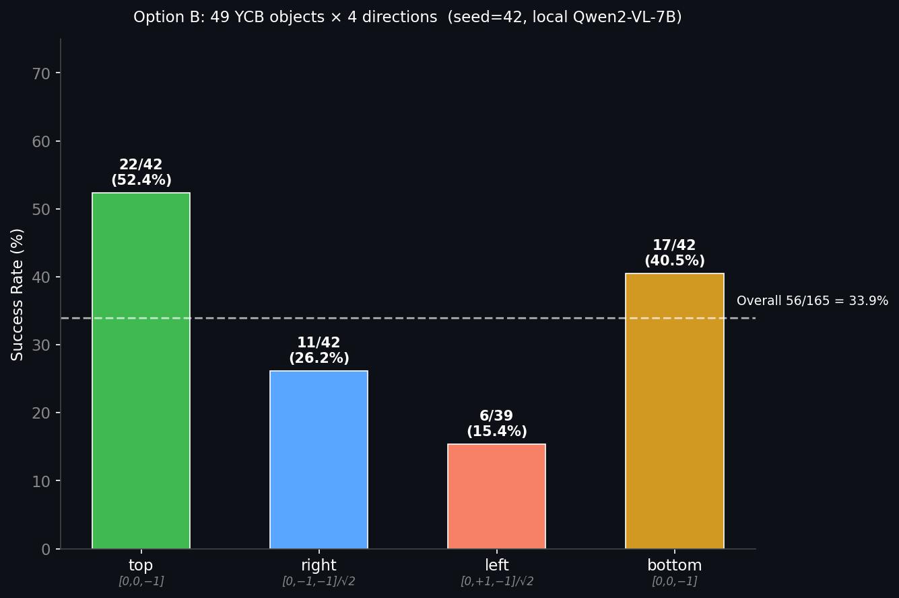
</p>

| Direction | Approach vector | Attempts | Success |
|-----------|----------------|----------|---------|
| top | `[0, 0, −1]` | 42 | 22 **(52%)** |
| right | `[0, −1, −1]/√2` | 42 | 11 **(26%)** |
| left | `[0, +1, −1]/√2` | 39 | 6 **(15%)** |
| bottom | `[0, 0, −1]` | 42 | 17 **(40%)** |
| **Total** | | **165** | **56 (34%)** |

### Perfect Objects (4/4 Directions)

| Object | Notes |
|--------|-------|
| 014_lemon | oval, graspable from all sides |
| 017_orange | round, symmetric |
| 054_softball | round, symmetric |
| 056_tennis_ball | round, symmetric |

### Zero-Success Objects (0/4)

| Object | Root cause |
|--------|-----------|
| 003_cracker_box | flat faces, RAGT candidates unreliable near edges |
| 025_mug | handle occludes reliable approach angles |
| 026_sponge | deformable, contact geometry inconsistent |
| 035_power_drill | elongated, thin trigger region |
| 037_scissors | very thin silhouette, empty mask interior |
| 042_adjustable_wrench | thin, irregular shape |
| 048_hammer | elongated handle, head asymmetry confuses RAGT |
| 052_extra_large_clamp | thin jaw arms, large aspect ratio |
| 061_foam_brick | soft, RAGT not calibrated for deformable |
| 065-f_cups | stacked cups: only top cup accessible |
| 072-a_toy_airplane | wings are thin and fragile |
| 077_rubiks_cube | VLM code error (return outside function) |

### Ablation: Direction Axis Bug History

| Run | right approach | right success | total |
|-----|---------------|---------------|-------|
| Broken (X-axis) | `[−1, 0, −1]/√2` | 0/39 **(0%)** | 29.5% |
| Fixed (Y-axis) | `[0, −1, −1]/√2` | 13/39 **(33%)** | 42.7% |

The original mapping used ±X for left/right. Because the robot sits at X = −0.615 and the object at X ≈ 0, approaching from −X (the robot side) puts the pre-grasp pose *behind* the arm — kinematically inaccessible. Switching to ±Y fixed the right direction entirely.

---

## Semantic Part Grasping (`run_clamp_parts_demo.py`)

For objects with named parts, `find_part(object, part)` (backed by VLPart) locates a sub-region mask. The same 6-DoF pipeline applies with part-specific approach directions.

Part-specific contact offsets are derived from the VLM jaw angle `θ` rather than bbox extents, since the part mask already localises the finger contact region.

See the demo at the top of this page for results on the medium clamp (3/3 parts success).

---

## Known Limitations

- **left direction (15%)**: `[0, +1, −1]/√2` is geometrically correct but the Panda arm finds it harder than right due to joint-limit asymmetry. IK seeding or a slightly adjusted angle may help.
- **GT position only**: grasp center uses the simulator's ground-truth object pose. A real deployment would need camera-to-world depth unprojection via `K` + extrinsics.
- **Elongated objects (0%)**: thin/irregular geometry produces unreliable RAGT candidates. `find_part()` is recommended for these objects.
- **VLM direction extraction errors**: Qwen2-VL-7B occasionally generates `return` at module scope (Python error) or an unrecognised direction string. A larger model or structured JSON output would reduce these.

---

## Future Work

See [README.md — Future Work](../README.md#future-work) for the full list. The highest-priority items specific to the directional system:

1. **Real-depth unprojection** — replace GT `obj_pos` with camera-intrinsic depth unprojection so the pipeline works on a real robot.
2. **Left-direction IK seeding** — provide a left-biased joint configuration as the OMPL start pose to improve the 15% success rate.
3. **Candidate filtering by mask coverage** — reject RAGT candidates whose grasp rectangle overlaps <20% with the object mask (the main failure mode for elongated objects).
4. **Continuous direction** — extend the VLM prompt to output a unit vector instead of a discrete label, supporting prompts like "grasp from the upper-right corner".

---

## Scripts

| Script | Purpose |
|--------|---------|
| `run_mustard_demo.py` | 4-direction demo for any single YCB object (`--object-id`) |
| `run_all_objects_demo.py` | Full batch: 49 objects × 4 directions with crash safety + resume |
| `run_clamp_parts_demo.py` | 3 semantic-part prompts on `050_medium_clamp` |

See [SCRIPTS.md](../SCRIPTS.md) for CLI flags and output layout.
