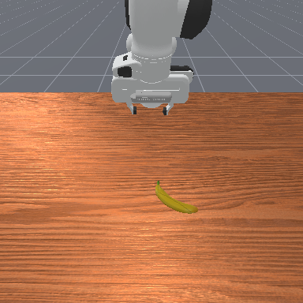
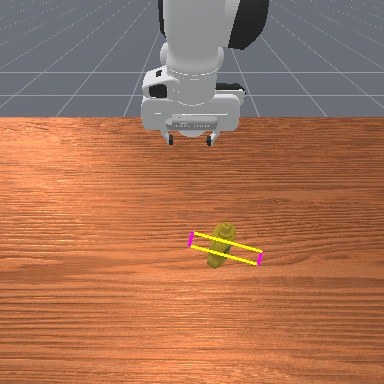

# GraspMAS — Local Qwen2-VL Implementation

Language-driven robotic grasp detection using a multi-agent system with local Qwen2-VL-7B inference on AMD MI300X (ROCm 6.2.4).

---

## System Architecture

```
User Query + RGB Image
        │
        ▼
┌───────────────────────────────────────────────────────┐
│  PLANNER  (Qwen2-VL-7B)                               │
│  Reads query → writes step-by-step Python plan        │
│  "Find the banana, detect its grasp pose"             │
└──────────────────────┬────────────────────────────────┘
                       │ plan (natural language)
                       ▼
┌───────────────────────────────────────────────────────┐
│  CODER  (Qwen2-VL-7B)                                 │
│  Translates plan → executable Python using ImagePatch │
│  Calls: find(), grasp_detection(), find_part()        │
└──────────────────────┬────────────────────────────────┘
                       │ code → execute() → grasp_pose
                       ▼
┌───────────────────────────────────────────────────────┐
│  OBSERVER  (Qwen2-VL-7B)                              │
│  Reviews RGB + grasp visualization                    │
│  Checks: target match, semantic alignment,            │
│          fragile overlap, collision risk              │
│  Verdict: VALID → return  |  INVALID → retry          │
└──────────────────────┬────────────────────────────────┘
                       │ VALID
                       ▼
              Final Grasp Pose (2D)
```

The Planner → Coder → Observer loop repeats up to `max_round` times (default 4) until the Observer returns VALID or rounds are exhausted.

---

## Example Output

**Query:** `"Grasp the banana"`

| Input Scene | Grasp Prediction |
|---|---|
|  |  |

The magenta/yellow rectangle is the predicted 2D grasp: centre `(cx, cy)`, jaw width `w`, contact depth `h`, and rotation `θ`. Green lines show the jaw axis direction.

```
g = (cx=1.0, cy=224.4, w=261.8, h=66.5, θ=15.5°)   verdict=VALID
```

> Coordinates are patch-relative — GraspNet runs on the object crop returned by `find()`, not the full 384×384 image.

**Query:** `"Grasp the mustard bottle"`



```
g = (cx=1.0, cy=225.5, w=248.7, h=71.7, θ=13.4°)   verdict=VALID
```

---

## Simulation Environment

**ManiSkill 3** with SAPIEN PhysX backend running on CPU (AMD GPU lacks SAPIEN CUDA renderer).

| Environment | Description |
|---|---|
| `PickSingleYCB-v1` | One YCB object on table; 74 unique objects |
| `PickClutterYCB-v1` | Multiple YCB objects in a cluttered scene |

**Camera and depth setup:**

| Property | Value |
|---|---|
| Backend | `sim_backend='cpu'` |
| Camera | `base_camera` only (hand camera unavailable on CPU) |
| Resolution | 384×384 |
| FOV | 90° → `fx=fy=192, cx=cy=192` |
| Depth encoding | `int16`, values in **millimetres** — divide by 1000 for metres |

```python
env = gym.make(
    'PickSingleYCB-v1',
    obs_mode='rgbd',
    control_mode='pd_joint_pos',
    render_mode='rgb_array',
    sensor_configs=dict(shader_pack='default', width=384, height=384),
    sim_backend='cpu',
)
obs, _ = env.reset(seed=42)
rgb   = obs['sensor_data']['base_camera']['rgb'].cpu().squeeze().numpy()
depth = obs['sensor_data']['base_camera']['depth'].cpu().squeeze().numpy()  # mm
K     = obs['sensor_param']['base_camera']['intrinsic_cv'][0].cpu().numpy()
```

**Simulation observation** (RGB · Depth · third-person view):


**Robot arm executing a grasp** (from `scripts/run_maniskill_demo.py`):


**Execution video:** [maniskill_execution.mp4](assets/maniskill_execution.mp4)

---

## Running the System

### Single demo with ManiSkill
```bash
conda run -n graspmas python scripts/run_maniskill_demo.py
```
Outputs timestamped results to `runs/YYYYMMDD_HHMMSS/`.

### Full evaluation — PickSingleYCB (74 objects)
```bash
conda run -n graspmas --no-capture-output python scripts/run_graspmas_eval.py 2>/dev/null | tee runs/eval_single.log
```

### Full evaluation — PickClutterYCB (100 seeds)
```bash
conda run -n graspmas --no-capture-output python scripts/run_graspmas_cluttered_eval.py 2>/dev/null | tee runs/eval_cluttered.log
```

### Gemini Direct baseline (no GPU, pure HTTP)
```bash
python scripts/run_gemini_grasp.py --run_dir runs/20260522_215724_graspmas_single/ --delay 8
```
Requires `gemini.key` in the project root. Outputs `gemini_results.json` to the run directory.

---

## Evaluation Metrics

| Metric | Description |
|---|---|
| Detection rate | % objects where `grasp_pose ≠ None` |
| VALID rate | % where Observer's final verdict = VALID |
| Avg rounds | Mean Planner→Coder→Observer loops per object |
| Target match | % where Observer confirmed the correct object was grasped |
| Semantic alignment | % where grasp matched the intended object region |
| Fragile overlap | % where grasp contacted a sensitive/fragile area |
| Collision risk | % where grasp overlapped a non-target object |

> **Note:** VALID rate is the Observer's semantic verdict, not a physics execution success. An object assessed VALID may still fail to lift in simulation if the 2D→6-DoF projection is inaccurate.

---

## Results

> Comparison baseline: GraspMAS paper (GPT-4o) reports **0.82** single / **0.72** cluttered VALID rate.  
> This implementation uses Qwen2-VL-7B locally on AMD MI300X — no API cost, no cloud dependency.

### PickSingleYCB — 74 Objects

**Run:** `runs/20260522_215724_graspmas_single/`  
**Seed:** 42, `max_round=4`

| Metric | Ours (Qwen2-VL-7B) | Paper (GPT-4o) |
|---|---|---|
| Detection rate | **75.7%** (56/74) | — |
| VALID rate | **66.2%** (49/74) | **82.0%** |
| Avg time/object | 22.4s | 2.12s |
| Total runtime | 27.7 min | — |

**Best objects** (100% VALID): cans, tools, lego duplo, rubiks cube, toy airplane, foam brick, mug  
**Hardest objects** (0% detection): colored wood blocks, nine hole peg test, small toy airplane variants

---

### PickClutterYCB — 100 Random Seeds

**Run:** `runs/20260523_090650_graspmas_cluttered/`  
**Seeds:** 0–99, `max_round=4`

| Metric | Ours (Qwen2-VL-7B) | Paper (GPT-4o) |
|---|---|---|
| Detection rate | **50.0%** (50/100) | — |
| VALID rate | **35.0%** (35/100) | **72.0%** |
| Avg time/seed | 33.5s | 2.12s |
| Total runtime | 55.8 min | — |

**Best categories in clutter:**

| Object | n | Det% | VALID% |
|---|---|---|---|
| large clamp | 2 | 100% | 100% |
| foam brick | 3 | 100% | 67% |
| toy airplane | 9 | 89% | 67% |
| lego duplo | 14 | 57% | 57% |
| sponge | 5 | 100% | 20% |
| cups | 18 | 44% | 28% |

**Consistent failures in clutter:** peach, plum, strawberry, padlock, scissors, softball, pear, potted meat can — all 0% detection. Small and visually similar objects in dense clutter are the primary failure mode.

**Gap vs paper:**
- Single: −16pp — expected for a 7B vs ~200B model
- Cluttered: −37pp — multi-object disambiguation is where scale matters most
- Speed: 13× slower — local inference without quantization vs hosted GPT-4o

---

## File Structure

```
GraspMAS/
├── agents/
│   ├── graspmas.py          # Main orchestrator (Planner→Coder→Observer loop)
│   ├── planner.py           # Planner agent
│   ├── coder.py             # Coder agent
│   ├── observer.py          # Observer agent
│   ├── llm.py               # Local Qwen2-VL wrapper (OpenAI-compatible)
│   └── prompt/
│       ├── planner_prompt.py
│       ├── coder_prompt.py
│       └── observer_prompt.py
├── grasp/                   # GraspNet detection backend
├── image_patch.py           # VLM–GraspNet bridge (find, grasp_detection)
├── local_vlm.py             # Qwen2-VL-7B inference (AMD ROCm)
├── scripts/run_maniskill_demo.py    # Single demo with ManiSkill execution
├── scripts/run_graspmas_eval.py     # Benchmark: 74 YCB single objects
├── scripts/run_graspmas_cluttered_eval.py  # Benchmark: 100 cluttered seeds
├── scripts/run_ocidvlg_eval.py      # Benchmark: OCID-VLG real-world dataset
├── scripts/run_gemini_grasp.py      # Gemini Direct baseline (no GPU)
└── docs/
    ├── GRASPMAS_QWEN.md     # This file — local Qwen implementation
    └── QWEN_OCIDVLG.md     # OCID-VLG evaluation results
```
