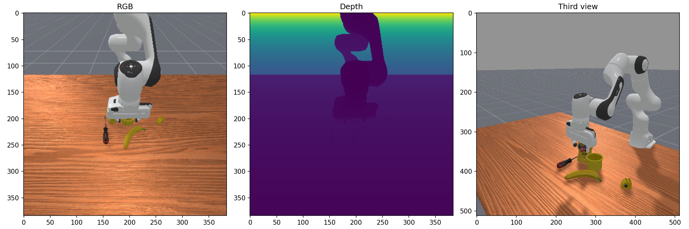
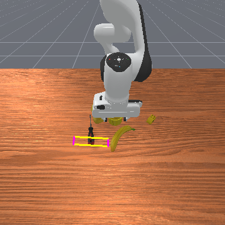

# GraspMAS — Grasp Pose Examples

---

## Grasp Pose Language

Every grasp detected by GraspMAS is represented as a 6-tuple:

```
g = (q,  cx,  cy,  w,  h,  θ)
```

| Field | Unit | Meaning |
|---|---|---|
| `q` | [0, 1] | GraspNet confidence score — how likely this grasp succeeds |
| `cx` | pixels | Grasp centre x — horizontal position in image (left = 0) |
| `cy` | pixels | Grasp centre y — vertical position in image (top = 0) |
| `w` | pixels | Jaw opening width — distance between the two gripper fingers |
| `h` | pixels | Finger contact depth — how far the fingers close around the object |
| `θ` | degrees | Jaw axis angle — 0° = horizontal, 90° = vertical, measured from x-axis |

The 2D rectangle is reconstructed as an oriented bounding box:
```python
box = cv2.boxPoints(((cx, cy), (w, h), -(θ + 180)))
```
Visualised as a magenta/yellow rectangle with green lines showing the jaw axis direction.

> **PickSingleYCB note:** GraspNet runs on the object crop returned by `find()`, not the full image. Coordinates `(cx, cy)` are patch-relative — `cx ≈ 1.0` is an artifact of the crop origin. Use `w`, `h`, and `θ` as the meaningful outputs for single-object scenes. PickClutterYCB stores full-image pixel coordinates (384×384) with quality scores.

---

## Worked Example — "Grasp the flat screwdriver."

### Pipeline

```
Query: "Grasp the flat screwdriver."
         │
         ▼  PLANNER
"Locate the flat screwdriver in the scene.
 Detect a suitable grasp on its handle."
         │
         ▼  CODER
def execute_command(image):
    image_patch = ImagePatch(image)
    patches = image_patch.find("flat screwdriver")
    if patches[0] is None:
        return None
    return image_patch.grasp_detection(patches[0])
         │
         ▼  OBSERVER  →  verdict: VALID
```

### Scene and Grasp

**Observation** (RGB · Depth · third-person view):



**Predicted grasp overlaid:**



**Execution:** [maniskill_execution.mp4](assets/maniskill_execution.mp4)

### Detected Grasp Pose

```
g = (q=1.000, cx=215.5, cy=263.2, w=71.5, h=20.0, θ=179.7°)
```

| Field | Value | Interpretation |
|---|---|---|
| `q` | 1.000 | Maximum confidence — clean, unoccluded detection |
| `cx` | 215.5 px | Centre-right of the 384px frame — screwdriver lies right of centre |
| `cy` | 263.2 px | Lower third of image — object close to camera |
| `w` | 71.5 px | Jaw spans ~71px across the screwdriver shaft |
| `h` | 20.0 px | Shallow contact depth — thin cylindrical object |
| `θ` | 179.7° | Near-horizontal grasp — aligned with the screwdriver's long axis |

---

## PickSingleYCB — 10 Examples

Environment: `PickSingleYCB-v1`, seed=42, `max_round=4`.  
All verdicts: VALID. Coordinates are **patch-relative** (see note above).

| # | Object | w (px) | h (px) | θ (°) | Verdict |
|---|---|---|---|---|---|
| 1 | master chef can | 42.5 | 53.0 | 8.9 | VALID |
| 2 | cracker box | 231.1 | 58.7 | 12.2 | VALID |
| 3 | banana | 261.8 | 66.5 | 15.5 | VALID |
| 4 | spatula | 275.6 | 101.7 | 19.4 | VALID |
| 5 | adjustable wrench | 271.1 | 74.9 | 14.5 | VALID |
| 6 | hammer | 251.1 | 71.0 | 12.9 | VALID |
| 7 | scissors | 263.3 | 71.9 | 23.1 | VALID |
| 8 | foam brick | 258.6 | 68.8 | 11.6 | VALID |
| 9 | tennis ball | 256.1 | 60.0 | 12.1 | VALID |
| 10 | rubiks cube | 255.3 | 63.0 | 12.6 | VALID |

**Full DSL per object:**

```
001  master chef can      g = (q=—, cx=1.0, cy=44.5,  w=42.5,  h=53.0,  θ=8.9°)
002  cracker box          g = (q=—, cx=1.0, cy=226.9, w=231.1, h=58.7,  θ=12.2°)
003  banana               g = (q=—, cx=1.0, cy=224.4, w=261.8, h=66.5,  θ=15.5°)
004  spatula              g = (q=—, cx=1.0, cy=216.9, w=275.6, h=101.7, θ=19.4°)
005  adjustable wrench    g = (q=—, cx=1.0, cy=233.4, w=271.1, h=74.9,  θ=14.5°)
006  hammer               g = (q=—, cx=1.0, cy=229.3, w=251.1, h=71.0,  θ=12.9°)
007  scissors             g = (q=—, cx=1.0, cy=237.5, w=263.3, h=71.9,  θ=23.1°)
008  foam brick           g = (q=—, cx=1.0, cy=223.8, w=258.6, h=68.8,  θ=11.6°)
009  tennis ball          g = (q=—, cx=1.0, cy=219.4, w=256.1, h=60.0,  θ=12.1°)
010  rubiks cube          g = (q=—, cx=1.0, cy=221.8, w=255.3, h=63.0,  θ=12.6°)
```

> `q=—` : quality score not persisted in the single-object eval run.  
> `cx≈1.0` : patch-origin artifact — the screwdriver's absolute position in the full image is in the full-image coordinate system; for single-object scenes the full-image position is implicit (one object on an empty table).

---

## PickClutterYCB — 10 Examples

Environment: `PickClutterYCB-v1`, `max_round=4`.  
Coordinates are **full-image** (384×384 px). Quality scores included.

| # | Seed | Object | cx | cy | w | h | θ (°) | q |
|---|---|---|---|---|---|---|---|---|
| 1 | 0 | apple | 125.7 | 209.5 | 65.0 | 13.8 | 163.7 | 1.000 |
| 2 | 1 | foam brick | 282.1 | 271.6 | 68.5 | 13.1 | 93.5 | 0.999 |
| 3 | 4 | toy airplane | 61.9 | 56.9 | 64.9 | 4.9 | 173.1 | 0.992 |
| 4 | 12 | rubiks cube | 252.4 | 261.1 | 59.7 | 12.2 | 18.6 | 1.000 |
| 5 | 25 | spatula | 63.2 | 55.8 | 65.7 | 5.6 | 174.5 | 0.994 |
| 6 | 33 | sponge | 146.2 | 228.8 | 74.3 | 12.4 | 101.2 | 0.992 |
| 7 | 34 | flat screwdriver | 215.5 | 263.2 | 71.5 | 20.0 | 179.7 | 1.000 |
| 8 | 45 | banana | 208.9 | 263.5 | 70.6 | 26.7 | 171.5 | 0.997 |
| 9 | 83 | lemon | 195.2 | 235.5 | 59.6 | 11.5 | 177.4 | 1.000 |
| 10 | 97 | cups | 117.7 | 218.3 | 68.0 | 15.3 | 178.7 | 0.999 |

**Full DSL per object:**

```
001  seed=0   apple            g = (q=1.000, cx=125.7, cy=209.5, w=65.0, h=13.8, θ=163.7°)
002  seed=1   foam brick       g = (q=0.999, cx=282.1, cy=271.6, w=68.5, h=13.1, θ=93.5°)
003  seed=4   toy airplane     g = (q=0.992, cx=61.9,  cy=56.9,  w=64.9, h=4.9,  θ=173.1°)
004  seed=12  rubiks cube      g = (q=1.000, cx=252.4, cy=261.1, w=59.7, h=12.2, θ=18.6°)
005  seed=25  spatula          g = (q=0.994, cx=63.2,  cy=55.8,  w=65.7, h=5.6,  θ=174.5°)
006  seed=33  sponge           g = (q=0.992, cx=146.2, cy=228.8, w=74.3, h=12.4, θ=101.2°)
007  seed=34  flat screwdriver g = (q=1.000, cx=215.5, cy=263.2, w=71.5, h=20.0, θ=179.7°)
008  seed=45  banana           g = (q=0.997, cx=208.9, cy=263.5, w=70.6, h=26.7, θ=171.5°)
009  seed=83  lemon            g = (q=1.000, cx=195.2, cy=235.5, w=59.6, h=11.5, θ=177.4°)
010  seed=97  cups             g = (q=0.999, cx=117.7, cy=218.3, w=68.0, h=15.3, θ=178.7°)
```

**Reading the cluttered examples:**
- `θ ≈ 170–180°` appears frequently — nearly horizontal grasps are the most common stable pose on a flat table
- `h` is consistently small (5–27px) compared to `w` — gripper closes shallow and wide, wrapping around objects rather than pinching
- `q ≥ 0.99` across all 10 — cluttered scenes with successful detection tend to produce very high-confidence grasps (GraspNet is conservative; low-confidence candidates get discarded by the pipeline)
