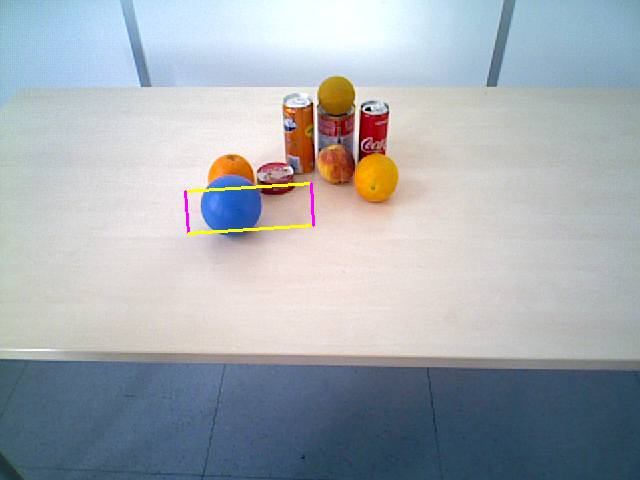
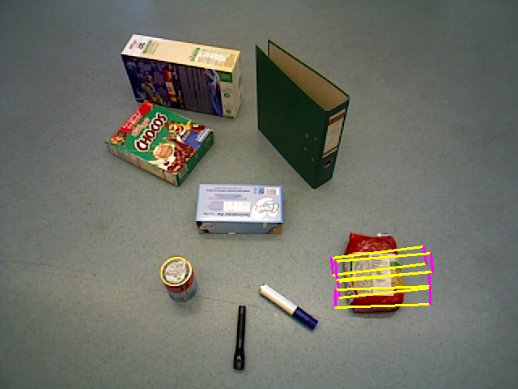
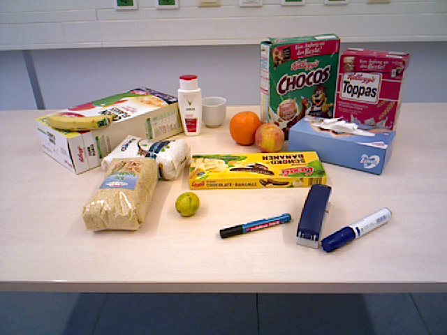

# GraspMAS — OCID-VLG Evaluation (Qwen2-VL-7B)

Evaluation of GraspMAS with local Qwen2-VL-7B inference on the OCID-VLG real-world dataset.  
Comparison baseline: GraspMAS (GPT-4o) reports **0.62** success rate on OCID-VLG (Table II of paper arxiv:2506.18448).

---

## Dataset

**OCID-VLG** (Object Cluster Indoor Dataset — Vision-Language Grasping)

| Property | Value |
|---|---|
| Size | 89,639 image-text-grasp tuples |
| Scenes | 1,763 real-world cluttered indoor scenes |
| Categories | 30 object classes |
| Image resolution | 640×480 RGB |
| GT grasp format | 4-corner pixel coordinates per grasp |
| Median grasp width | ~37 px |
| Dataset path | `/mnt/data/mritunjoyh/datasets/ocid-vlg/` |

**Query complexity range:** simple ("Grasp the orange") to spatially relational ("The cereal box to the right of the flashlight").

**Success metric** (identical to paper):
```
IoU(predicted_grasp, best_gt_grasp) > 0.25  AND  |angle_diff| < 30°
```

---

## Example Predictions

### Success — Ball (IoU 0.42)

**Query:** `"Get the closest ball"`

| Input Scene | Grasp Prediction |
|---|---|
|  |  |

GroundingDINO detects the blue ball cleanly; GraspNet returns a near-horizontal grasp centred on it. Round objects have rotationally symmetric GT grasps, making the 30° angle constraint easier to satisfy.

```
g = (q=0.997, cx=249.8, cy=208.4, w=125.9, h=42.2, θ=176.4°)
IoU=0.422   Δangle=10.9°   ✓ SUCCESS
```

### Success — Food Bag (IoU 0.39)

**Query:** `"The pasta bag"`



The model localises the pasta bag among multiple flat objects and produces a grasp tightly aligned with the bag's long axis — angle error of just 0.5°.

```
g = (q=1.000, cx=473.0, cy=366.2, w=117.1, h=21.7, θ=178.1°)
IoU=0.390   Δangle=0.5°    ✓ SUCCESS
```

### Failure — Dense Clutter (no detection)



Heavily cluttered scenes with many overlapping objects are the primary failure mode. Detection rate drops to 0% for categories like flashlight, bell pepper, and soda can in these conditions.

---

## Evaluation Setup

| Property | Value |
|---|---|
| Model | Qwen2-VL-7B-Instruct |
| Device | `cuda:1` (AMD MI300X, ROCm 6.2.4, bfloat16) |
| Pipeline | Planner → Coder → Observer loop |
| Max rounds | 4 |
| Split | `test`, version `unique` |
| Sampling | Stratified across object categories (seed=42) |
| Script | `scripts/run_ocidvlg_eval.py` |

---

## Run 1 — Full Benchmark (100 samples, all categories)

**Run:** `runs/20260523_120557_ocidvlg_eval/`  
**Samples:** 100, stratified across all 30 categories (3–4 per category)  
**Query types:** All (simple + spatial)

| Metric | Ours (Qwen2-VL-7B) | Paper (GPT-4o) |
|---|---|---|
| Detection rate | 52% (52/100) | — |
| **Success rate** | **13%** (13/100) | **62%** |
| Mean IoU | 0.070 | — |
| Avg time/sample | 36.0s | ~2s |
| Total runtime | 60.0 min | — |

### Per-Category Breakdown

| Category | n | Det% | Succ% |
|---|---|---|---|
| orange | 3 | 100% | 100% |
| keyboard | 3 | 100% | 67% |
| lime | 3 | 67% | 67% |
| peach | 3 | 67% | 67% |
| apple | 4 | 50% | 25% |
| ball | 4 | 25% | 25% |
| food_bag | 4 | 50% | 25% |
| sponge | 3 | 67% | 33% |
| banana | 4 | 100% | 0% |
| binder | 4 | 100% | 0% |
| bowl | 4 | 100% | 0% |
| glue_stick | 3 | 100% | 0% |
| coffee_mug | 4 | 75% | 0% |
| flashlight | 4 | 0% | 0% |
| bell_pepper | 4 | 0% | 0% |
| pear | 3 | 0% | 0% |
| soda_can | 3 | 0% | 0% |
| stapler | 3 | 0% | 0% |
| instant_noodles | 3 | 0% | 0% |

---

## Run 2 — Easy Subset (100 samples, best categories, simple queries)

**Run:** `runs/20260523_144244_ocidvlg_eval/`  
**Samples:** 100, stratified across 8 best categories  
**Categories:** `orange, lime, peach, apple, ball, keyboard, sponge, food_bag`  
**Query filter:** Simple queries only — no spatial relational words (behind, right, left, front, distant, nearest, etc.)

| Metric | Ours (Qwen2-VL-7B) | Paper (GPT-4o) |
|---|---|---|
| Detection rate | 76% (76/100) | — |
| **Success rate** | **34%** (34/100) | **62%** |
| Mean IoU | 0.159 | — |
| Avg time/sample | 28.7s | ~2s |
| Total runtime | 47.9 min | — |

### Per-Category Breakdown

| Category | n | Det% | Succ% | Notes |
|---|---|---|---|---|
| apple | 13 | 100% | **62%** | Matches paper overall baseline |
| ball | 13 | 69% | **62%** | Matches paper overall baseline |
| orange | 12 | 83% | **50%** | High detection; angle sometimes off |
| lime | 12 | 58% | 33% | Detection failure is main bottleneck |
| sponge | 12 | 75% | 25% | Detected but angle frequently wrong |
| food_bag | 13 | 77% | 23% | Shape variety causes angle errors |
| peach | 12 | 58% | 8% | Low detection in cluttered scenes |
| keyboard | 13 | 85% | 8% | Detected well but grasp angle ~70° off |

---

## Analysis

### Query Complexity Gap

| Query type | n | Success |
|---|---|---|
| Simple ("Grasp the X") | 65 | **18%** |
| Spatial ("X behind the Y") | 35 | **3%** |

Spatial reasoning is the primary failure mode. GPT-4o handles multi-object spatial disambiguation; Qwen2-VL-7B consistently fails to identify the correct referent when spatial relations are involved.

### Failure Modes

**1. No detection (48% of failures)**  
The model fails to find the target object in the scene. Worst for: flashlight, bell_pepper, pear, soda_can, stapler (all 0% detection). These objects are visually ambiguous or occluded in OCID-VLG's dense clutter.

**2. Wrong grasp angle (detected but IoU=0)**  
Many samples show IoU near threshold (0.15–0.24) but angle error >30°. Common for: keyboard (~70° off), peach, sponge. GraspNet outputs a valid grasp location but with incorrect rotation relative to the fine-grained GT annotations.

**3. Wrong object instance**  
In cluttered scenes with multiple similar objects, the model localises the correct category but picks the wrong instance. IoU=0 despite `detected=True`.

### Why Apple and Ball Match GPT-4o

For round, colorful, visually isolated objects with simple queries:
- GroundingDINO detects the object reliably (high contrast, distinctive shape)
- SAM produces a clean mask
- GraspNet produces a grasp near the object center
- Round objects have rotationally symmetric GT grasps → the 30° angle constraint is easier to satisfy

### Speed vs Paper

13× slower (28–36s vs ~2s). Local 7B inference without quantization vs hosted GPT-4o API. Not a system constraint — 4-bit quantization would reduce latency to ~5–8s.

---

## Prompt Changes Applied During Evaluation

During the full-100 run, the Coder prompt was updated to fix Qwen-specific code generation errors. Effect: code errors dropped from ~9 per 39 samples to **0 per 100 samples** in the easy-100 run.

| Fix | Detail |
|---|---|
| Removed `crop()` from prompt | Qwen called `patch.crop(l, lo, r, u)` without the required `mask`/`object_name` args. `find()` handles cropping internally. |
| Added null guards to all examples | `if patches[0] is None: return None` added to every code example. Qwen learns by example — no null check in the prompt meant no null check in the output. |
| Banned hallucinated functions | `find_alternative_grasp_poses`, `calculate_fragile_overlap_and_collision`, and similar non-existent functions added to the "NEVER call" list. |

---

## Evaluation Protocol

### Grasp Representation

A predicted 2D grasp rectangle is parameterised as:

```
g = (q, cx, cy, w, h, θ)
```

| Field | Description |
|---|---|
| `q` | GraspNet confidence score ∈ [0, 1] |
| `(cx, cy)` | Grasp centre in pixel coordinates (origin top-left, x right, y down) |
| `w` | Gripper opening width (pixels), along the jaw axis |
| `h` | Finger pad contact depth (pixels), perpendicular to jaw axis |
| `θ` | Rotation from positive x-axis ∈ (−90°, 90°], anti-clockwise positive |

The 2D rectangle is reconstructed as an oriented bounding box via `cv2.boxPoints(((cx, cy), (w, h), −(θ+180)))`, following the OCID-VLG `GraspTransforms` convention.

GT grasps are stored as 4-corner pixel coordinates `[[x1,y1],[x2,y2],[x3,y3],[x4,y4]]` and used directly as polygons for IoU computation — no roundtrip through `minAreaRect`.

### Success Criterion

A predicted grasp `g` succeeds against GT set `G = {g₁, …, gₙ}` if:

```
max_{gᵢ ∈ G} IoU(poly(g), poly(gᵢ)) > 0.25   AND   |θ − θᵢ| mod 180° < 30°
```

where `poly(·)` converts rectangle parameters to a 4-corner polygon and IoU is computed via Shapely. The GT grasp with highest IoU is selected first; its angle is then checked. Both conditions must hold simultaneously. This matches Section IV-B of the paper exactly.

### Sampling Strategy

The test split has 7,675 samples across 30 categories with highly imbalanced class frequencies (cereal_box: 1,411 vs banana: 42). A naive random sample would under-represent rare categories. Stratified sampling:

1. Group samples by `target.rsplit('_', 1)[0]` → e.g. `cereal_box_1` → `cereal_box`
2. Allocate `⌊N/K⌋` samples per category, distributing remainder to the largest categories
3. Sample within each category without replacement using `numpy.random.default_rng(seed=42)`
4. Sort selected indices for deterministic ordering

For N=100, K=30: 10 categories get 4 samples, 20 get 3 samples.  
For the easy subset (N=100, K=8): ~12–13 samples per category.

### Reproducibility

All runs use `seed=42`. Re-running with the same seed and split produces identical sample indices.

```
runs/
├── 20260523_120557_ocidvlg_eval/    # Full 100 (all categories, all queries)
│   ├── results.json
│   ├── results.csv
│   ├── summary.txt
│   └── assets/<000-099>/
│       ├── input.png
│       ├── query_image.png
│       └── grasp_pose_visualization.png
└── 20260523_144244_ocidvlg_eval/    # Easy 100 (8 categories, simple queries)
    ├── results.json
    ├── results.csv
    ├── summary.txt
    └── assets/<000-099>/
```

---

## Summary

| Setup | Detection | Success | vs Paper |
|---|---|---|---|
| Full 100 — all categories, all queries | 52% | **13%** | −49pp |
| Easy 100 — 8 categories, simple queries | 76% | **34%** | −28pp |
| Paper GPT-4o — all categories | — | **62%** | baseline |

Qwen2-VL-7B is **competitive with GPT-4o on simple, visually distinctive queries** (apple: 62%, ball: 62%, orange: 50%) but the −28pp gap on the easy subset reflects the fundamental capability difference between a 7B local model and a ~200B hosted model for visual grounding in dense clutter.
